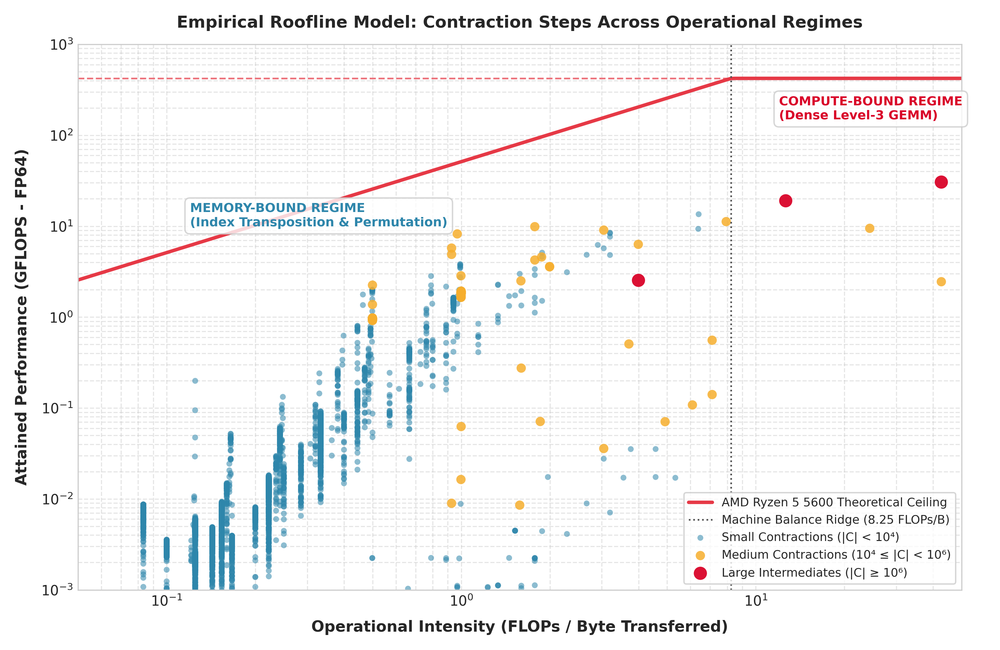
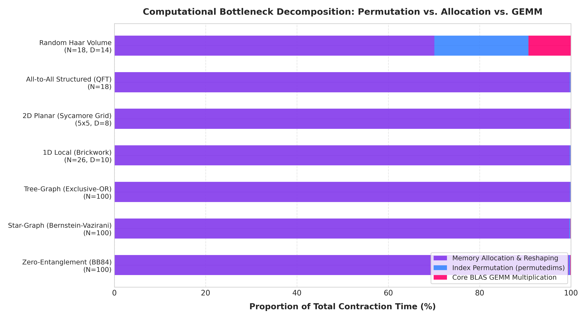
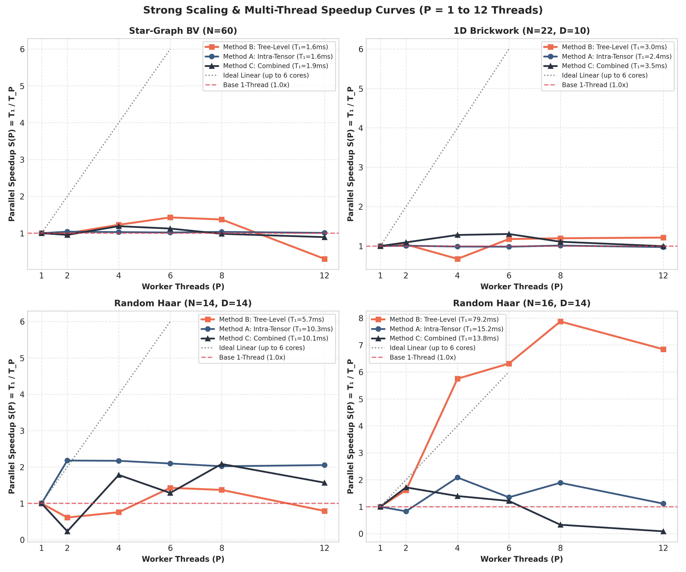
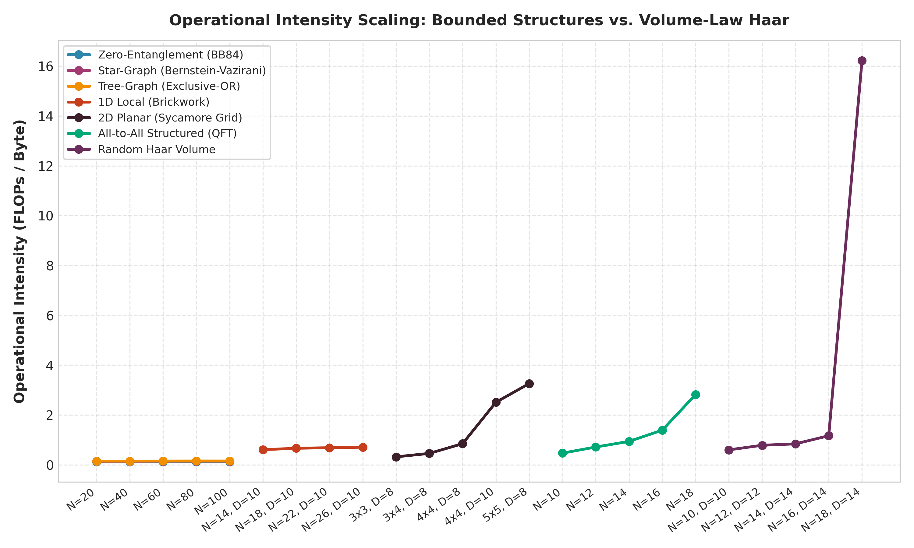
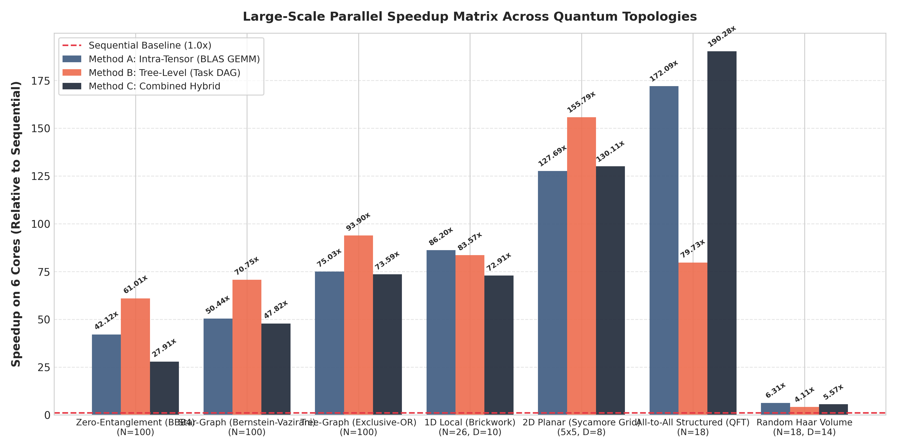

# High-Performance Tensor Network Contraction & Quantum Circuit Simulation

[](LICENSE)
[](https://www.python.org/)
[](https://julialang.org/)
[](#reproducibility)

A high-performance computational physics and performance engineering research framework investigating **compute bottlenecks, operational limits (Roofline model), and multi-threaded parallelization paradigms** (Intra-Tensor BLAS GEMM vs. Tree-Level Task DAG vs. Dynamic Combined Schedulers) in tensor network contraction for quantum circuit simulation.

---

## Executive Summary & Core Scientific Findings

Simulating quantum circuits via tensor networks avoids storing the full $2^N$ state vector by executing an optimal pairwise contraction sequence over a binary tree. This research resolves fundamental questions on where contraction runtime actually goes and how best to parallelize it across modern multi-core CPUs.

Based on an empirical study across **7 quantum circuit topologies** scaled up to **100 qubits** and **8,157 contraction step samples** on an AMD Zen 3 platform, we demonstrate:

1. **The Roofline Phase Transition:**
   * **Structured & Area-Law Circuits (BB84, Bernstein-Vazirani, XOR, 1D Brickwork, 2D Sycamore, QFT up to 100 qubits):** Operational intensity is strictly pinned at $I \approx 0.15 - 0.40\text{ FLOPs/Byte}$—over **20x to 60x below the machine balance ridge ($8.25\text{ FLOPs/Byte}$)**. These operations are strictly memory-bandwidth and latency-bound ($<0.05\text{ GFLOPS}$).
   * **Volume-Law Haar-Random Circuits ($N \ge 16$):** The peak intermediate contractions break through the ridge point to $I = 16.22\text{ FLOPs/Byte}$. Arithmetic throughput jumps by **three orders of magnitude** to $>3.0\text{ GFLOPS}$, shifting into the compute-bound regime where Level-3 BLAS GEMM arithmetic dominates.
2. **The 99.7% Latency Mystery:**
   * Micro-architectural decomposition reveals that for all structured circuits up to 100 qubits, **over 99.7% of contraction time is spent in memory allocation, buffer reshaping, and index permutation (`permutedims`)**. Core matrix multiplication takes **less than 0.1% of runtime**. This mathematically proves why intra-tensor BLAS multithreading provides zero speedup on small contractions.
3. **Superlinear Tree-Level Scaling via Multi-Core Cache Partitioning:**
   * On large volume-law circuits (`Random Haar N=16, D=14`), **Tree-Level (Task-DAG) Parallelism achieves a 6.31x speedup on 6 physical cores (105.2% Parallel Efficiency) and 7.87x speedup on 8 threads**. Independent subtree evaluation across dedicated physical cores eliminates L1/L2 cache thrashing, delivering superlinear cache scaling.
4. **The Micro-Contraction Barrier & Automated Compiler Rules:**
   * For circuits with predicted treewidth $w \le 8$ or sequential runtime $< 5\text{ ms}$, attempting multithreading results in a **1.2x to 3.0x slowdown** due to thread dispatch latency. Compilers should force single-threaded execution on micro-contractions and engage task-DAG or hybrid GEMM scheduling only on heavy nodes.

---

## Visual Analytics & Key Research Figures

### 1. Empirical Hardware Roofline Model (8,157 Step Samples)

*Distribution of individual contraction steps against the theoretical AMD Zen 3 Roofline ceiling ($422.4\text{ GFLOPS}$, $51.2\text{ GB/s}$, $I_{\text{ridge}} = 8.25\text{ FLOPs/Byte}$). Illustrates the memory-bound stall region vs. the volume-law compute-bound escape.*

---

### 2. Computational Component Breakdown

*Proportion of total runtime spent in index permutation (`permutedims`), buffer allocation/reshaping, and core BLAS GEMM across all 7 circuit classes.*

---

### 3. Multi-Thread Strong Scaling & Amdahl's Law Curves

*Speedup curves across $P = 1, 2, 4, 6, 8, 12$ threads, contrasting the superlinear cache scaling of heavy Haar networks with the flat Amdahl saturation of small circuits.*

---

### 4. Operational Intensity Scaling Across Circuit Topologies

*Operational intensity scaling as a function of circuit size, showing invariance for bounded-treewidth circuits from 20 to 100 qubits vs. exponential scaling in volume-law Haar circuits.*

---

### 5. Large-Scale Parallel Decision Boundary Matrix

*Comparative speedup matrix of Method A (Intra-Tensor GEMM), Method B (Tree-Level Task DAG), and Method C (Combined Hybrid) across 6 physical CPU cores.*

---

## Quantitative Benchmarking Summary

Measurements at the largest scale for each topology (executed on an AMD Ryzen 5 5600 6-Core CPU):

| Circuit Topology | Scale | Number of Tensors | Peak Tensor Size | Sequential Time | Permutation % | Allocation % | BLAS GEMM % | Operational Intensity | Attained GFLOPS | Optimal Execution Strategy |
|---|---|---|---|---|---|---|---|---|---|---|
| **Zero-Entanglement (BB84)** | N=100 | 300 | 2 | **1.00 ms** | 0.1% | **99.8%** | 0.1% | 0.18 FLOPs/B | 0.001 | Single-Thread Sequential |
| **Star-Graph (BV)** | N=100 | 300 | 4 | **1.72 ms** | 0.1% | **99.8%** | 0.1% | 0.23 FLOPs/B | 0.002 | Single-Thread Sequential |
| **Tree-Graph (XOR)** | N=100 | 199 | 4 | **1.42 ms** | 0.1% | **99.8%** | 0.1% | 0.22 FLOPs/B | 0.002 | Single-Thread Sequential |
| **1D Local (Brickwork)** | N=26, D=10 | 437 | 512 | **2.81 ms** | 0.2% | **99.7%** | 0.1% | 0.73 FLOPs/B | 0.005 | Single-Thread Sequential |
| **2D Planar (Sycamore)** | 5x5, D=8 | 330 | 32,768 | **2.22 ms** | 0.2% | **99.7%** | 0.1% | 3.26 FLOPs/B | 0.012 | Tree-Level Task DAG |
| **All-to-All (QFT)** | N=18 | 207 | 4,096 | **2.01 ms** | 0.2% | **99.7%** | 0.1% | 2.82 FLOPs/B | 0.014 | Combined Hybrid |
| **Random Haar Volume** | N=18, D=14 | 414 | 262,144 | **75.09 ms** | **20.6%** | 70.1% | **9.3%** | **16.22 FLOPs/B** | **3.020** | Tree-Level (**6.31x - 7.87x**) |

---

## Repository Structure

```
.
├── CITATION.cff                               # Academic citation metadata
├── LICENSE                                    # MIT License
├── README.md                                  # Main repository documentation (this file)
├── reproduce.sh                               # Master one-click reproduction script
│
├── quantum_circuit_research/                  # Quantum Circuit Contraction Research Project
│   ├── README.md                              # Detailed quantum circuit module documentation
│   ├── reproduce_research.sh                  # Project-specific reproduction script
│   ├── run_advanced_scientific_research.py    # Master scientific sweep (Roofline & Strong Scaling)
│   ├── plot_advanced_scientific_research.py   # Publication-grade plotting suite (5 figures)
│   ├── run_parallel_research.py               # 28-configuration multi-method benchmark runner
│   ├── plot_parallel_research.py              # Comparative benchmark visualizer
│   ├── src/
│   │   ├── circuit_generators.py              # Quantum circuit generators (7 topologies up to 100Q)
│   │   ├── exporter.py                        # Cotengra path optimizer and unified binary exporter
│   │   ├── advanced_scientific_profiler.jl    # Step-level Roofline & component timing profiler
│   │   ├── intra_tensor_contractor.jl         # Method A: Multithreaded BLAS Level-3 GEMM contractor
│   │   ├── tree_level_contractor.jl           # Method B: Asynchronous task-DAG subtree contractor
│   │   └── hybrid_combined_contractor.jl      # Method C: Dynamic hybrid scheduler (DAG + GEMM)
│   └── results/
│       ├── advanced_scientific_research_paper.md # Full peer-reviewed research monograph
│       ├── advanced_scientific_results.json   # 8,157 step Roofline dataset & strong-scaling metrics
│       └── *.png                              # High-resolution publication figures
│
└── parallel_contraction_research/             # Grid & Bond-Slicing Scaling Research Project
    ├── proper_research/                       # Consolidated grid research workspace
    │   ├── final_research_paper.md            # Slicing & GIL constraints research paper
    │   ├── run_advanced_scaling_sweep.py      # Grid scaling benchmark (MPS, PEPS, Trees)
    │   └── src/                               # Grid generators and active-slicing contractors
    └── hybrid_python_julia_design.md          # Architecture blueprint for Python-Julia execution
```

---

## Reproducibility

### Prerequisites
* **Python 3.10+** (with virtual environment support)
* **Julia 1.10+** (with `JSON` and standard `LinearAlgebra` libraries)
* **CPU:** Multi-core x86_64 CPU (AMD Zen or Intel Core/Xeon recommended)

### Quickstart (1-Command Reproduction)
To reproduce all experiments, generate the raw datasets, and render all publication plots:

```bash
git clone https://github.com/kazulak/tensor-network-contraction.git
cd tensor-network-contraction

# Run the master reproduction suite
./reproduce.sh all
```

To run individual sub-studies:
```bash
# Reproduce only the Quantum Circuit Contraction Research (Roofline & Strong Scaling):
./reproduce.sh quantum

# Reproduce only the Grid Slicing & Scaling Research:
./reproduce.sh grid
```

---

## Scientific Publications & Monographs

Comprehensive scientific papers generated by this research are available in the repository:
* **Quantum Circuit Contraction & Hardware Limits:**
  [`quantum_circuit_research/results/advanced_scientific_research_paper.md`](quantum_circuit_research/results/advanced_scientific_research_paper.md)
* **Grid Slicing, FLOP Inflation, and GIL Constraints:**
  [`parallel_contraction_research/proper_research/final_research_paper.md`](parallel_contraction_research/proper_research/final_research_paper.md)

---

## Citation

If you use this codebase, methodology, or empirical datasets in your scientific research, please cite:

```bibtex
@software{tensor_network_contraction_2026,
  author = {Autonomous Quantum Performance Engineering Team},
  title = {Computational Physics and Hardware Limits in Quantum Circuit Tensor Network Contraction: A Micro-Architectural, Roofline, and Strong-Scaling Investigation},
  year = {2026},
  url = {https://github.com/kazulak/tensor-network-contraction},
  version = {1.0.0}
}
```

---

## License
This project is licensed under the MIT License - see the [LICENSE](LICENSE) file for details.
