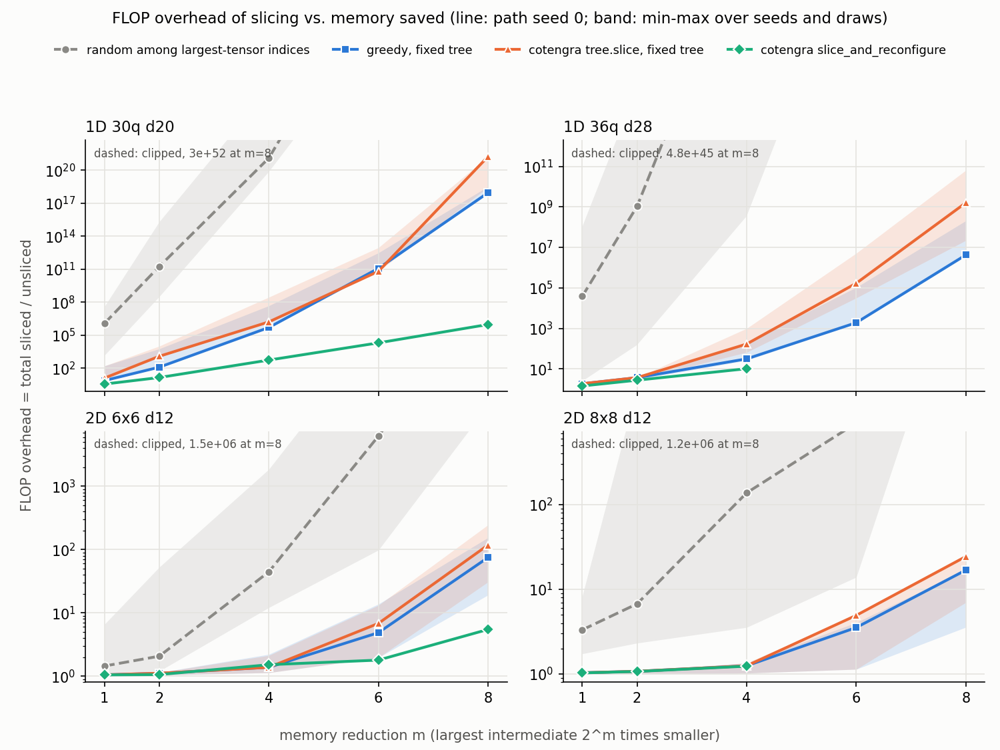

# What does slicing cost? FLOP overhead vs. memory saved for random-circuit amplitude networks

## Question

When a tensor network is too large to contract in memory, *slicing* fixes the values of a few indices and sums the
results of the independent sub-contractions. **How much extra computation does slicing cost for a given memory saving,
and does the choice of which indices to slice matter?**

Everything here is measured by **counting** (complex multiply-adds and the size of the largest intermediate tensor),
never by wall-clock time. All numbers below come from the code in this directory: the two tables are spliced in verbatim from `results.md` and
`run_study.log`, and numbers quoted in the prose were read off those files and `pytest_output.txt`. Where I mention a preliminary check that is not saved, I say so and quote no numbers.

## Method

**Circuits.** Amplitudes `<x|C|0...0>`; every two-qubit gate is an independent Haar-random U(4) matrix
(`haar_u4`: QR of a complex Ginibre matrix with the phases of `diag(R)` removed, complex128). There are no single-qubit gates.
* *1D*: nearest-neighbour brickwork on `n` qubits, alternating even/odd bonds, open boundary.
* *2D*: `lx x ly` square grid, nearest-neighbour gates, coupler patterns in the order ABCDCDAB (repeated), where
  A/B/C/D = horizontal-even / vertical-even / horizontal-odd / vertical-odd bonds. This is "Sycamore-like" only in the
  layer order (as I remember it from arXiv:1910.11333); it is a plain square lattice with Haar U(4) gates, not the real device layout or fSim gates.

**Network.** Each gate is a rank-4 tensor with dimension-2 legs; the `|0>` inputs and `<x|` outputs are absorbed into the
adjacent gate tensors before path finding (not counted). Every index is then a dimension-2 bond shared by exactly two tensors and
the result is a scalar. Counts depend only on the graph, not on the gate values or on `x` (the study uses `x = 0...0`).

**Cost model.** A pairwise contraction of tensors with index sets A and B costs `2^|A ∪ B|` complex multiply-adds ("MACs"; a complex MAC is 4 real
multiplications + 4 real additions). Memory = size of the largest intermediate result. With index set S sliced, one slice costs the same formula with
S removed from every tensor; the total over all `2^|S|` slices is `2^|S| x` that. **FLOP overhead** = total sliced MACs / unsliced MACs *of the same
base tree*. Nothing is shared between slices: sub-contractions that do not touch a sliced index are recomputed in every slice, i.e. overheads are worst-case.

**Memory reduction `m`.** The target is that the largest intermediate be `2^m` times smaller than the base tree's (m = 1, 2, 4, 6, 8; the table
shows m = 2, 4, 8, i.e. 4x, 16x, 256x smaller). Every strategy below was checked by the counter to have reached its target (`assert` in `run_study.py`).

**Base trees.** cotengra `HyperOptimizer` (greedy candidates, 64 repeats, `minimize="flops"`) followed by `subtree_reconfigure()`. `kahypar` and
`optuna` are not installed, so cotengra falls back to random sampling of greedy hyper-parameters. Its default `labels` method took minutes on a 290-tensor network where `greedy` took
seconds (preliminary test, not saved), so only `greedy` is used. Passing `seed=` to `HyperOptimizer` did not make runs reproducible in my test; I seed Python's and NumPy's global RNGs instead. Three path-finder seeds (0, 1, 2) give three base trees per instance.

**Slicing strategies** (all evaluated by my counter, on the same base tree unless stated):
| name | rule |
|---|---|
| `uniform` | add random bonds (any bond of the network) until the target is reached |
| `memory` | add a random bond that lies in a currently over-target intermediate (memory-aware, cost-blind); 5 random draws per tree, as for `uniform` |
| `greedy` | my rule: among bonds in over-target intermediates, take the one with the smallest increase in log2 total cost per unit of excess size removed |
| `ctg-slice` | cotengra `tree.slice(target_size=...)`, default settings except `minimize="flops"`, fixed tree |
| `ctg-reconf` | cotengra `tree.slice_and_reconfigure(target_size=...)` (same defaults): the tree is re-optimised while slicing (only path seed 0; on the large instances only m <= 4 because it is slow) |

Which strategies to include was decided after preliminary runs on the small instances. In those I also tried cotengra's `HyperOptimizer(slicing_opts=...)`
(joint path search + slicing); it was slower and not better in the two cases I looked at, so it is not reported.

**Instances** (from `run_study.log`; "d" = number of gate layers; `6x6`/`8x8` = qubit grid). "Small" = 1D 30q and 2D 6x6, "large" = 1D 36q and 2D 8x8. Only counts are computed for all of them.
```
2D 6x6 d12 seed 0: 180 tensors, unsliced 2^24.60 MACs, largest intermediate 2^18, 21s
2D 6x6 d12 seed 1: 180 tensors, unsliced 2^24.41 MACs, largest intermediate 2^18, 29s
2D 8x8 d12 seed 0: 336 tensors, unsliced 2^31.44 MACs, largest intermediate 2^24, 34s
2D 6x6 d12 seed 2: 180 tensors, unsliced 2^24.74 MACs, largest intermediate 2^18, 37s
2D 8x8 d12 seed 1: 336 tensors, unsliced 2^31.67 MACs, largest intermediate 2^24, 55s
2D 8x8 d12 seed 2: 336 tensors, unsliced 2^31.62 MACs, largest intermediate 2^24, 79s
1D 36q d28 seed 0: 490 tensors, unsliced 2^36.58 MACs, largest intermediate 2^27, 105s
1D 36q d28 seed 1: 490 tensors, unsliced 2^36.65 MACs, largest intermediate 2^28, 151s
1D 30q d20 seed 0: 290 tensors, unsliced 2^28.17 MACs, largest intermediate 2^19, 174s
1D 36q d28 seed 2: 490 tensors, unsliced 2^36.55 MACs, largest intermediate 2^27, 195s
1D 30q d20 seed 1: 290 tensors, unsliced 2^28.36 MACs, largest intermediate 2^19, 204s
1D 30q d20 seed 2: 290 tensors, unsliced 2^28.12 MACs, largest intermediate 2^19, 229s
```
(one line per path-finder seed; the time is cumulative wall time of that instance's process)

**Correctness** (`test_tnslice.py`, 28 tests, all pass; observed deviations in `pytest_output.txt`): gates are unitary to 1e-13 and pass a Haar statistic
(`E|Tr U|^2 = 1`, which a QR without the phase fix fails); layers are nearest-neighbour matchings; the state-vector code reproduces dense Kronecker-product matrices;
for four small circuits (7-9 qubits, 1D and 2D) the unsliced network contraction equals the state-vector amplitude, and for each of the five strategies the sum over all
slices of (up to 7 of) the chosen indices equals both, all asserted `< 1e-10`. The largest absolute deviation printed in `pytest_output.txt` is 6.67e-17 (amplitudes there are ~0.03-0.04). My counter equals the
multiply-adds and largest intermediate actually executed by the contraction, and equals cotengra's `contraction_cost()` / `max_size()` for the unsliced trees. On the 36-qubit 2D study geometry
(no state vector possible; with its own tree from a 16-repeat search, not the study's trees) the full greedy slice set for a 16x reduction (5 slices) gives the same amplitude as the unsliced contraction to relative difference 3.66e-15. I also
injected six bugs by hand (non-Haar gates, non-unitary gate, swapped gate legs, only the first slice summed, two cost-counter errors) into a scratch copy; the tests caught all six.
That scratch check is not saved in this directory.

## Results

Cells: `k / overhead (min-max)`: `k` = number of sliced indices (`2^k` slices); overhead for path seed 0 (median over 5 draws for `uniform`, `memory`); (min-max) over all three path seeds
(and draws); `ctg-reconf` is one tree, no range; `n/a` = not run. Values above 2^60 are printed as `1e<rounded exponent>`.

| instance | strategy | 4x smaller: k / overhead (min-max) | 16x smaller: k / overhead (min-max) | 256x smaller: k / overhead (min-max) |
|---|---|---|---|---|
| 1D 30q d20 | uniform | 143 / 1e42 (1e25-1e59) | 227 / 1e66 (1e49-1e81) | 333 / 1e97 (1e89-1e111) |
| 1D 30q d20 | memory | 40 / 1.72e+11 (3.22e+08-2.05e+15) | 75 / 1e21 (1e20-1e27) | 184 / 1e52 (1e44-1e63) |
| 1D 30q d20 | greedy | 9 / 122 (122-5.71e+03) | 23 / 4.95e+05 (4.95e+05-4.71e+07) | 68 / 8.74e+17 (8.26e+17-1e19) |
| 1D 30q d20 | ctg-slice | 13 / 1.19e+03 (1.19e+03-1e+04) | 25 / 1.6e+06 (1.6e+06-2.82e+08) | 80 / 1e21 (1e18-1e21) |
| 1D 30q d20 | ctg-reconf | 6 / 14 | 14 / 541 | 29 / 9.31e+05 |
| 2D 6x6 d12 | uniform | 45 / 6.77e+12 (1.5e+05-1e30) | 87 / 1e25 (6.01e+07-1e41) | 166 / 1e47 (1e38-1e64) |
| 2D 6x6 d12 | memory | 3 / 2.07 (1.2-52.6) | 10 / 44.4 (12.1-1.86e+03) | 29 / 1.49e+06 (1.9e+04-3.08e+07) |
| 2D 6x6 d12 | greedy | 2 / 1.11 (1.04-1.14) | 4 / 1.38 (1.13-2.21) | 14 / 74.8 (19.1-154) |
| 2D 6x6 d12 | ctg-slice | 2 / 1.11 (1.04-1.14) | 4 / 1.38 (1.13-2.12) | 15 / 118 (30.8-245) |
| 2D 6x6 d12 | ctg-reconf | 2 / 1.06 | 5 / 1.52 | 10 / 5.47 |
| 1D 36q d28 | uniform | 172 / 1e51 (1e21-1e78) | 304 / 1e89 (1e58-1e112) | 433 / 1e127 (1e102-1e171) |
| 1D 36q d28 | memory | 33 / 1.07e+09 (152-7.96e+14) | 80 / 1e23 (3.45e+08-1e28) | 161 / 1e46 (1e33-1e62) |
| 1D 36q d28 | greedy | 4 / 3.74 (2.97-3.74) | 9 / 31.6 (26.4-201) | 30 / 4.23e+06 (4.23e+06-2.07e+08) |
| 1D 36q d28 | ctg-slice | 4 / 3.74 (2.97-3.74) | 13 / 170 (66.6-1e+03) | 40 / 1.59e+09 (2.21e+07-6.4e+10) |
| 1D 36q d28 | ctg-reconf | 5 / 2.8 | 9 / 10.3 | n/a |
| 2D 8x8 d12 | uniform | 44 / 2.21e+12 (1.02e+09-1e73) | 92 / 1e26 (1e18-1e81) | 199 / 1e57 (1e53-1e100) |
| 2D 8x8 d12 | memory | 5 / 6.74 (2.32-2.44e+03) | 12 / 138 (3.56-1.02e+05) | 30 / 1.22e+06 (1.07e+05-1.02e+08) |
| 2D 8x8 d12 | greedy | 2 / 1.08 (1-1.08) | 4 / 1.25 (1.03-1.36) | 12 / 16.9 (3.57-17) |
| 2D 8x8 d12 | ctg-slice | 2 / 1.08 (1-1.08) | 4 / 1.25 (1.03-1.36) | 13 / 24.4 (7-24.4) |
| 2D 8x8 d12 | ctg-reconf | 2 / 1.07 | 4 / 1.24 | n/a |

Unsliced memory-optimised tree (no slicing), per path-finder seed: memory reduction m reached / FLOP ratio to the min-FLOP tree

- 1D 30q d20: m=0 / 3.16x, m=0 / 1.42x, m=0 / 3.09x
- 2D 6x6 d12: m=0 / 9.03x, m=0 / 10.3x, m=0 / 8.04x
- 1D 36q d28: m=0 / 2.59x, m=1 / 1.78x, m=0 / 2.73x
- 2D 8x8 d12: m=0 / 15.7x, m=0 / 21.9x, m=0 / 5.98x



*Figure.* Overhead (log scale) vs. memory reduction `m`. Lines: path seed 0; bands: min-max over path seeds and random draws. The `uniform` strategy is not drawn, and the
dashed `memory` line leaves the panel at the top (its m=8 value is printed in each panel); the table has all numbers. The green (aqua) line is only
drawn where `ctg-reconf` was run. It is below 3:1 contrast on the light background, so identity is also carried by marker shape, the legend and the table.

## Answer

**How much extra computation for a given memory saving?** It depends strongly on geometry and on how much memory is saved, and the price rises steeply with `m`.
* *2D grids (both sizes):* the first reductions are almost free: 2 sliced indices make the largest intermediate 4x smaller for 1.06x-1.11x the FLOPs (`greedy`, `ctg-slice`, `ctg-reconf`,
  both 2D instances, seed 0). 16x smaller costs 1.24x-1.52x (4-5 indices). 256x smaller costs 74.8x (`greedy`) or 5.47x (`ctg-reconf`) on 6x6, and 16.9x (`greedy`) on 8x8.
* *1D brickwork:* the same memory saving is far more expensive. 4x smaller costs 3.74x (`greedy`) / 2.8x (`ctg-reconf`) on the 36-qubit circuit and 122x / 14x on the 30-qubit one (which
  needs 9 and 6 slices where 2 would be the ideal); 16x costs 31.6x / 10.3x and 4.95e5x / 541x; 256x costs 4.23e6x (`greedy`, 36q) and 8.74e17x / 9.31e5x (`greedy` / `ctg-reconf`, 30q).
* For `greedy` the log-overhead per halving grows with `m` on all four instances (the curves bend upward), so each further halving costs a larger factor than the last;
  the `ctg-reconf` curve on the 30-qubit 1D circuit is close to a straight line on the log scale. (Checked on the seed-0 medians of the plotted points with a throwaway snippet that is not kept here.)
  I did not test *why* 1D is much worse than 2D here.
* Context: an *unsliced* tree optimised for memory (same search machinery) shrank the largest intermediate by at most 2x (m=1 for one seed of the 36-qubit 1D circuit, m=0 for all others), at
  1.42x-21.9x more FLOPs (list under the table). So within this study, memory reductions beyond ~2x needed slicing; this is limited by the quality of my path search.

**Does the choice of which indices to slice matter?** Yes, at several levels, by orders of magnitude:
1. *Random bonds vs. anything targeted:* `uniform` needs 44-433 slices for the 4x-256x targets, with median overheads of 2.21e12 or more (table); presumably most bonds simply do not touch the largest tensors (I did not test this).
2. *Memory-aware but cost-blind vs. cost-aware* (`memory` vs. `greedy`): 8x8 grid: 6.74x vs. 1.08x at 4x smaller and 1.22e6x vs. 16.9x at 256x; 30-qubit 1D: 1.72e11x vs. 122x at 4x smaller.
3. *Among cost-aware rules on the same tree:* `greedy` was never worse than cotengra's default `tree.slice` in any cell of the table (equal in some cells, mostly at the smaller reductions, better in the others; e.g. 8.74e17x vs. ~1e21x at 256x on 30q 1D).
   This says my greedy rule is competitive with cotengra's default settings on these trees; it does not say it is better than a tuned cotengra slicer.
4. *Re-optimising the tree while slicing* mattered most in 1D (541x vs. 4.95e5x at 16x on 30q) and at 256x in 2D (5.47x vs. 74.8x on 6x6), and hardly at all for <= 16x in 2D (1.24x vs. 1.25x on 8x8; 1.52x vs. 1.38x on 6x6, where it is slightly worse).
5. *The base tree itself* matters: the min-max column shows spreads of more than an order of magnitude at 4x smaller (122 to 5.71e3 for `greedy` on 30q 1D) between three path-finder seeds.

## Limitations

* **Counting, not timing.** No wall-clock, memory-bandwidth, BLAS-efficiency (very small tensors run far below peak) or parallelism effects. Slicing's real benefit (fitting in memory, independent parallel slices) is not measured. "Memory" is the largest
  intermediate only, not the peak of simultaneously live tensors.
* **Overheads assume no reuse between slices**: sub-contractions that do not involve any sliced index are counted once per slice. Caching them would lower the real overheads.
* **Weak, non-optimal path finder** (random greedy + `subtree_reconfigure`, 64 repeats, no `kahypar`/`optuna`). Base trees are not optimal, and a better tree would change absolute overheads (the spread over three
  seeds is already large). Overheads are relative to *my* base trees.
* **Small experiment.** 4 instances (two per geometry), 3 path seeds, 5 random draws; min-max ranges are of few samples, not confidence intervals. `ctg-reconf` ran on one tree only and (for the large instances)
  only up to 16x. Geometry, size and depth trends beyond these sizes are not established, and the 1D-vs-2D difference is unexplained. Sizes were chosen so the study runs in minutes, and are far smaller than real supremacy-scale networks.
* **Strategy comparison is design- and setting-dependent.** cotengra's slicers ran with default arguments; `greedy` is one hand-written heuristic. Strategy choice was informed by preliminary runs on the small instances (see Method).
* **Model simplifications.** Rank-4 gate tensors with dimension-2 bonds (no gate splitting or other network transformations), no single-qubit gates, Haar U(4) instead of hardware gates, open boundaries, amplitude of one bitstring only.
  Gate randomness does not affect any count, so "random circuits" enters only through the geometry and the correctness tests.
* **Validation scope.** State-vector agreement is tested for <= 9 qubits; the 36-qubit check compares sliced vs. unsliced only. The study's actual trees and counts were not executed (only counted); the counter is validated against executed contractions on the small test circuits and on one 36-qubit tree.
* **Runtime.** The four instances take 229 s, 195 s, 37 s and 79 s (last progress line of each in `run_study.log`), about 9 min run one after another. `run_study.py` runs them in 4 parallel processes on an 8-core laptop CPU: 3 m 52 s wall time, no single instance longer than 229 s. Run serially,
  the whole study would exceed the "few minutes" target. `results.json` was identical (parsed) across independent full runs.
* opt_einsum is installed but not used; contraction, counting and slicing code are my own, with cotengra used for path finding and for the `ctg-*` strategies.

## References

Cited from memory; I did not look these up online in this session, so check the IDs before relying on them.
* Mezzadri, "How to generate random matrices from the classical compact groups", arXiv:math-ph/0609050 (Haar sampling by QR with phase correction).
* Markov & Shi, "Simulating quantum computation by contracting tensor networks", arXiv:quant-ph/0511069 (contraction cost is governed by treewidth-like properties of the network graph).
* Gray & Kourtis, "Hyper-optimized tensor network contraction", arXiv:2002.01935 (the method behind cotengra's `HyperOptimizer`; I am not sure which of its slicing heuristics match the cotengra calls used here).
* Arute et al., "Quantum supremacy using a programmable superconducting processor", arXiv:1910.11333 (the ABCDCDAB layer pattern that the 2D circuits imitate).

I have not cited the original papers on fixing/"cutting" indices for circuit simulation because I am not sure of their exact IDs.

## Files

* `tnslice.py` (117 lines): circuits, state vector, network builder, path finding (cotengra), cost counter, slicing rules, executor.
* `run_study.py` (97 lines): the study -> `results.json` (raw rows), `results.md`, `overhead_vs_memory.png`, `run_study.log` (stdout).
* `test_tnslice.py` (86 lines): pytest checks; `pytest_output.txt` = `python -m pytest -q -s test_tnslice.py`.
* Total 300 lines including blank lines and comments. Python 3.14.0, numpy 2.4.6, cotengra 0.7.5, matplotlib 3.10.7, pytest 9.1.1.
* Reproduce: `python -m pytest -q -s test_tnslice.py` (~3 s) and `python run_study.py` (~4 min).
