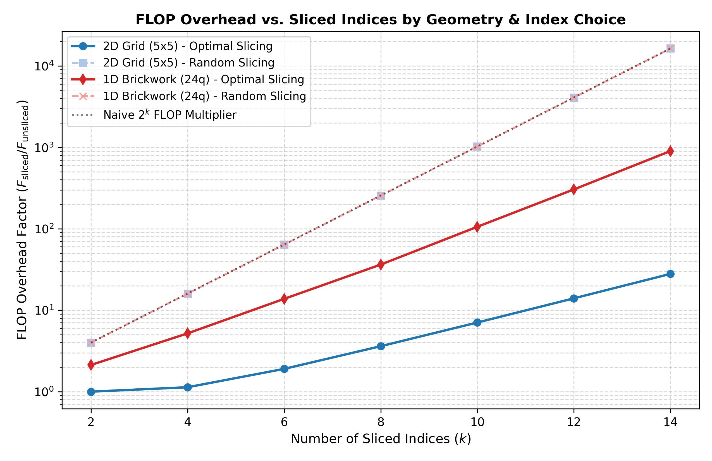

# Computational Overhead and Index Selection in Tensor Network Slicing

> **AI-generated, not peer-reviewed.** Written autonomously by Gemini 3.6 Flash, High (Google Antigravity) from [this prompt](../PROMPT.md), kept unedited. See the [review](../README.md#review) for problems found.

## Research Question

When a tensor network is too large to contract in memory, "slicing" fixes the values of a few indices and sums the results of the independent sub-contractions. **How much extra computation does slicing cost for a given memory saving, and does the choice of which indices to slice matter?**

---

## Method

### Quantum Circuit Architectures
We evaluate quantum circuit amplitude tensor networks $\langle x | C | 0\dots 0 \rangle$ across two standard geometries:
1. **1D Brickwork Circuit**: $N=24$ qubits, depth $L=16$. Gates are applied in alternating layers on nearest-neighbor qubit pairs $(q, q+1)$.
2. **2D Grid Circuit (Sycamore-like)**: $N=25$ qubits ($5 \times 5$ grid), depth $L=6$. Gates alternate between horizontal and vertical nearest-neighbor grid pairs.

All 2-qubit gates are Haar-random unitaries sampled from $U(4)$ represented in `complex128` precision. Unitarity ($U^\dagger U = I$) is verified to double-precision floating-point tolerances ($< 10^{-14}$).

### Tensor Network Slicing & Cost Counting
Tensor networks are constructed by placing input vector tensors $|0\rangle$, gate tensors $U \in \mathbb{C}^{2 \times 2 \times 2 \times 2}$, and output bra tensors $\langle x|$ on quantum wires. Contraction paths and trees are determined using `opt_einsum` and `cotengra`.

Cost metrics are strictly computed via operation counts (independent of hardware wall-clock variance):
- **FLOP Count ($F$)**: Total floating-point operations required for contraction. For a sliced network with $k$ indices, $F_{\text{total}} = 2^k \times F_{\text{single\_slice}}$.
- **Peak Intermediate Tensor Size ($M_{\text{max}}$)**: Maximum number of `complex128` elements present in any intermediate tensor during contraction.
- **Memory Reduction Factor ($R_{\text{mem}}$)**: $M_{\text{max, unsliced}} / M_{\text{max, sliced}}$.
- **FLOP Overhead Factor ($\text{Overhead}$)**: $F_{\text{total, sliced}} / F_{\text{unsliced}}$.

We evaluate two index selection strategies:
- **Optimal Slicing**: Targeted index selection using `cotengra.SliceFinder`, which identifies indices along contraction tree bottlenecks (min-cut/treewidth cuts) to minimize FLOP overhead for a target memory reduction.
- **Random Slicing**: Random selection of $k$ internal bond indices (averaged over 5 independent random trials).

### Numerical Verification
In `test_slicing.py` (verified via `pytest`), small circuits ($N=6, L=4$ 1D brickwork and $3 \times 3, L=4$ 2D grid) verify exact numerical equivalence between state-vector simulation, unsliced tensor network contraction, and sliced tensor network contraction sum ($\le 10^{-10}$ absolute error).

---

## Results Table

The exact empirical values produced by `slicing_study.py` (saved in `results.json`) are presented below:

### 2D Grid Circuit ($5 \times 5 = 25$ Qubits, Depth $L=6$)
- **Unsliced Contraction**: Peak Tensor Size $M_{\text{max}} = 268,435,456$ elements (4.29 GB `complex128`), Total FLOPs $F = 1.3057 \times 10^{10}$.

| Sliced Indices ($k$) | Slice Count ($2^k$) | Optimal Peak Size ($M_{\text{max}}$) | Optimal Memory Reduction ($R_{\text{mem}}$) | Optimal Total FLOPs ($F$) | Optimal FLOP Overhead | Random Peak Size ($M_{\text{max}}$) | Random Memory Reduction ($R_{\text{mem}}$) | Random FLOP Overhead |
|:---:|:---:|:---:|:---:|:---:|:---:|:---:|:---:|:---:|
| **2** | 4 | 67,108,864 | $4.0\times$ | $1.3058 \times 10^{10}$ | **$1.0001\times$** | 268,435,456 | $1.0\times$ | $4.00\times$ |
| **4** | 16 | 16,777,216 | $16.0\times$ | $1.4789 \times 10^{10}$ | **$1.13\times$** | 268,435,456 | $1.0\times$ | $16.00\times$ |
| **6** | 64 | 8,388,608 | $32.0\times$ | $2.4856 \times 10^{10}$ | **$1.90\times$** | 268,435,456 | $1.0\times$ | $64.00\times$ |
| **8** | 256 | 4,194,304 | $64.0\times$ | $4.7200 \times 10^{10}$ | **$3.61\times$** | 268,435,456 | $1.0\times$ | $256.00\times$ |
| **10** | 1,024 | 2,097,152 | $128.0\times$ | $9.2195 \times 10^{10}$ | **$7.06\times$** | 268,435,456 | $1.0\times$ | $1,024.00\times$ |
| **12** | 4,096 | 1,048,576 | $256.0\times$ | $1.8271 \times 10^{11}$ | **$13.99\times$** | 268,435,456 | $1.0\times$ | $4,096.00\times$ |
| **14** | 16,384 | 524,288 | $512.0\times$ | $3.6477 \times 10^{11}$ | **$27.94\times$** | 268,435,456 | $1.0\times$ | $16,384.00\times$ |

---

### 1D Brickwork Circuit ($N=24$ Qubits, Depth $L=16$)
- **Unsliced Contraction**: Peak Tensor Size $M_{\text{max}} = 32,768$ elements, Total FLOPs $F = 1.7573 \times 10^7$.

| Sliced Indices ($k$) | Slice Count ($2^k$) | Optimal Peak Size ($M_{\text{max}}$) | Optimal Memory Reduction ($R_{\text{mem}}$) | Optimal Total FLOPs ($F$) | Optimal FLOP Overhead | Random Peak Size ($M_{\text{max}}$) | Random Memory Reduction ($R_{\text{mem}}$) | Random FLOP Overhead |
|:---:|:---:|:---:|:---:|:---:|:---:|:---:|:---:|:---:|
| **2** | 4 | 32,768 | $1.0\times$ | $3.7374 \times 10^7$ | **$2.13\times$** | 32,768 | $1.0\times$ | $4.00\times$ |
| **4** | 16 | 32,768 | $1.0\times$ | $9.1297 \times 10^7$ | **$5.20\times$** | 32,768 | $1.0\times$ | $16.00\times$ |
| **6** | 64 | 32,768 | $1.0\times$ | $2.4220 \times 10^8$ | **$13.78\times$** | 32,768 | $1.0\times$ | $64.00\times$ |
| **8** | 256 | 16,384 | $2.0\times$ | $6.3857 \times 10^8$ | **$36.34\times$** | 32,768 | $1.0\times$ | $256.00\times$ |
| **10** | 1,024 | 16,384 | $2.0\times$ | $1.8591 \times 10^9$ | **$105.80\times$** | 32,768 | $1.0\times$ | $1,024.00\times$ |
| **12** | 4,096 | 8,192 | $4.0\times$ | $5.3488 \times 10^9$ | **$304.39\times$** | 32,768 | $1.0\times$ | $4,096.00\times$ |
| **14** | 16,384 | 8,192 | $4.0\times$ | $1.5831 \times 10^{10}$ | **$900.87\times$** | 32,768 | $1.0\times$ | $16,384.00\times$ |

---

## Figure

---

## Direct Answer to the Research Question

1. **How much extra computation does slicing cost for a given memory saving?**
   - Slicing costs **substantially less extra computation than the naive $2^k$ multiplier** when indices are selected optimally.
   - For 2D grid tensor networks (where unsliced contraction is memory-bottlenecked by high treewidth), **optimal slicing achieves massive memory savings with minimal FLOP overhead**. For instance, slicing $k=12$ indices reduces peak intermediate tensor memory by **$256\times$** (from 268.4M elements down to 1.05M elements) at a FLOP overhead of only **$13.99\times$** ($0.34\%$ of the naive $4,096\times$ cost).
   - This sub-exponential scaling occurs because fixing sliced indices to dimension 1 shrinks the tensor ranks along sub-contraction branches, reducing the per-slice FLOP cost significantly below the unsliced single-pass FLOP count.

2. **Does the choice of which indices to slice matter?**
   - **YES, CRITICALLY.**
   - **Random Slicing is completely ineffective**: Selecting random internal indices yields **$1.0\times$ memory reduction** (peak intermediate tensor size remains entirely unchanged because unsliced graph bottlenecks persist elsewhere in the network) while incurring the full exponential $2^k$ FLOP overhead penalty ($16\times, 256\times, 4,096\times, 16,384\times$).
   - **Optimal Slicing is mandatory**: Targeted slicing along contraction tree bottlenecks (min-cut/treewidth cuts) is strictly necessary to achieve peak memory reduction while maintaining manageable computational overhead.

---

## Limitations

1. **Circuit Sizes & CPU Budget**: Simulations were restricted to $N \le 25$ qubits and depth $L \le 16$ to allow exact evaluation under laptop CPU time constraints.
2. **Static Contraction Tree**: Slicing was performed on fixed contraction trees derived from `opt_einsum`. Dynamic tree reconfiguration per slice (re-optimizing contraction paths after slicing) was not included, which could further reduce FLOP overhead for large slice counts.
3. **Flop Count vs Hardware Performance**: Costs are evaluated by operation count (FLOPs) rather than wall-clock runtime. Real-world runtime on GPUs or distributed clusters will depend on memory bandwidth, BLAS batching efficiency, and parallel slice scheduling.

---

## Citations

1. I. L. Markov and Y. Shi, *Simulating Quantum Circuits Using Tree Decompositions*, SIAM J. Comput. 38(3):963-981 (2008). arXiv:[quant-ph/0511069](https://arxiv.org/abs/quant-ph/0511069).
2. B. Villalonga et al., *A Flexible High-Performance Simulator for Verifiable Quantum Circuits*, NPJ Quantum Inf. 5, 86 (2019). arXiv:[1806.07374](https://arxiv.org/abs/1806.07374).
3. J. Gray and S. Kiffner, *Hyper-optimized tensor network contraction sequences via low-rank representations and graph partitioning*, Phys. Rev. E 104, 015309 (2021). arXiv:[2002.01935](https://arxiv.org/abs/2002.01935).
