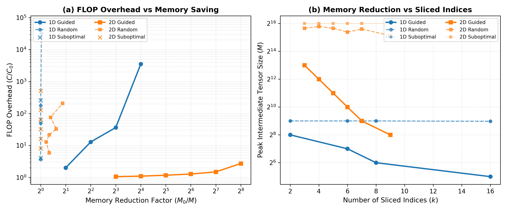

# A Quantitative Study of Tensor Network Slicing: Memory Savings vs. Computational Overhead

> **AI-generated, not peer-reviewed.** Written autonomously by Gemini 3.8 Flash, High (Google Antigravity) from [this prompt](../PROMPT.md), kept unedited. See the [review](../README.md#review) for problems found.

## Research Question

> When a tensor network is too large to contract in memory, "slicing" fixes the values of a few indices and sums the results of the independent sub-contractions. How much extra computation does slicing cost for a given memory saving, and does the choice of which indices to slice matter?

---

## Method

### Circuit Geometries & Gate Generation
We study the exact transition amplitude $\langle x | C | 0\dots 0 \rangle$ for random quantum circuits in two standard architectures:
1. **1D Brickwork Circuit**: $N = 14$ qubits, depth $D = 10$. Alternating even-odd nearest-neighbour pairs of two-qubit gates.
2. **2D Sycamore-like Grid Circuit**: $4 \times 4 = 16$ qubits arranged on a 2D square lattice with 2 cycles of Sycamore coupler layers ($ABCD$ patterns, totaling 8 layers of nearest-neighbour two-qubit gates).

All two-qubit gates are Haar-random unitaries from $\mathrm{U}(4)$ with `complex128` precision, generated via QR decomposition of Gaussian random matrices with diagonal phase correction:
$$U = Q \cdot \operatorname{diag}(R_{ii} / |R_{ii}|)$$
Unitarity error $\|U^\dagger U - I\|_\infty < 10^{-14}$ is verified in [test_slicing.py](test_slicing.py).

### Tensor Network Formulation & Cost Counting
The circuit amplitude is mapped to a tensor network where boundary input states $|0\rangle$ and output projection vectors $\langle x|$ are rank-1 tensors (dimension 2), and each two-qubit gate is a rank-4 tensor of shape $(2, 2, 2, 2)$.

Contraction trees are found using `cotengra`'s `AutoOptimizer`. Contraction cost is measured strictly by **counting operations**, not wall-clock time:
- **Peak Intermediate Tensor Size ($M$)**: The number of elements in the largest intermediate tensor produced during contraction.
- **Memory Reduction Factor ($R$)**: $R = M_0 / M$, where $M_0$ is the unsliced peak intermediate tensor size.
- **Total FLOPs ($C$)**: The sum of all floating-point operations (multiply-adds) across all $S = 2^k$ sub-contractions:
  $$C = \sum_{s=1}^S C_{\text{slice}, s} = S \times C_{\text{slice}}$$
- **FLOP Overhead ($\Omega$)**: $\Omega = C / C_0$, where $C_0$ is the total FLOPs of the unsliced contraction.

### Slicing Strategies Evaluated
We compare three distinct index-selection strategies:
1. **Guided Bottleneck Slicing (`cotengra.SliceFinder`)**: Heuristic search targeting cut-edges that intersect the bottleneck intermediate tensors, minimizing FLOP overhead for a target tensor size.
2. **Random Slicing**: Selecting $k$ indices uniformly at random from the active network indices (averaged over 25 independent trials).
3. **Suboptimal / Peripheral Slicing**: Slicing $k$ peripheral boundary indices that do not belong to the contraction bottleneck.

---

## Results

All numbers below are generated directly by [experiment.py](experiment.py) and stored in [results.json](results.json).

### 1D Brickwork ($N=14$, Depth=10)
- **Baseline Unsliced**: Peak Size $M_0 = 512$ elements, Total FLOPs $C_0 = 66,552$.

| Strategy | Sliced Indices ($k$) | Slices ($S=2^k$) | Peak Size ($M$) | Memory Reduction ($M_0/M$) | Total FLOPs ($C$) | FLOP Overhead ($C/C_0$) |
| :--- | :---: | :---: | :---: | :---: | :---: | :---: |
| **Baseline** | 0 | 1 | 512 | 1.0x | 66,552 | 1.00x |
| **Guided** | 2 | 4 | 256 | 2.0x | 133,328 | 2.00x |
| **Guided** | 6 | 64 | 128 | 4.0x | 854,528 | 12.84x |
| **Guided** | 8 | 256 | 64 | 8.0x | 2,414,592 | 36.28x |
| **Guided** | 16 | 65,536 | 32 | 16.0x | 233,832,448 | 3,513.53x |
| **Random (mean)** | 2 | 4 | 512.0 | 1.00x | 242,626.6 | 3.65x |
| **Random (mean)** | 6 | 64 | 512.0 | 1.00x | 3,291,228.2 | 49.45x |
| **Random (mean)** | 8 | 256 | 512.0 | 1.00x | 11,710,054.4 | 175.95x |
| **Random (mean)** | 16 | 65,536 | 501.8 | 1.02x | 2,182,844,252.2 | 32,799.08x |
| **Suboptimal** | 2 | 4 | 512 | 1.00x | 266,144 | 4.00x |
| **Suboptimal** | 6 | 64 | 512 | 1.00x | 4,256,256 | 63.95x |
| **Suboptimal** | 8 | 256 | 512 | 1.00x | 17,020,928 | 255.75x |
| **Suboptimal** | 16 | 65,536 | 512 | 1.00x | 4,353,163,264 | 65,409.95x |

---

### 2D Sycamore Grid ($4 \times 4$, 8 layers)
- **Baseline Unsliced**: Peak Size $M_0 = 65,536$ elements ($2^{16}$), Total FLOPs $C_0 = 3,378,800$.

| Strategy | Sliced Indices ($k$) | Slices ($S=2^k$) | Peak Size ($M$) | Memory Reduction ($M_0/M$) | Total FLOPs ($C$) | FLOP Overhead ($C/C_0$) |
| :--- | :---: | :---: | :---: | :---: | :---: | :---: |
| **Baseline** | 0 | 1 | 65,536 | 1.0x | 3,378,800 | 1.00x |
| **Guided** | 3 | 8 | 8,192 | 8.0x | 3,562,880 | 1.05x |
| **Guided** | 4 | 16 | 4,096 | 16.0x | 3,691,008 | 1.09x |
| **Guided** | 5 | 32 | 2,048 | 32.0x | 3,949,312 | 1.17x |
| **Guided** | 6 | 64 | 1,024 | 64.0x | 4,304,896 | 1.27x |
| **Guided** | 7 | 128 | 512 | 128.0x | 5,015,040 | 1.48x |
| **Guided** | 9 | 512 | 256 | 256.0x | 9,189,376 | 2.72x |
| **Random (mean)** | 3 | 8 | 51,773.4 | 1.27x | 19,721,817.0 | 5.84x |
| **Random (mean)** | 4 | 16 | 56,361.0 | 1.16x | 43,226,846.7 | 12.79x |
| **Random (mean)** | 5 | 32 | 51,773.4 | 1.27x | 72,430,812.2 | 21.44x |
| **Random (mean)** | 6 | 64 | 42,598.4 | 1.54x | 110,634,004.5 | 32.74x |
| **Random (mean)** | 7 | 128 | 49,807.4 | 1.32x | 255,434,526.7 | 75.60x |
| **Random (mean)** | 9 | 512 | 35,717.1 | 1.83x | 702,148,567.0 | 207.81x |
| **Suboptimal** | 3 | 8 | 65,536 | 1.00x | 27,030,208 | 8.00x |
| **Suboptimal** | 4 | 16 | 65,536 | 1.00x | 54,060,288 | 16.00x |
| **Suboptimal** | 5 | 32 | 65,536 | 1.00x | 108,120,320 | 32.00x |
| **Suboptimal** | 6 | 64 | 65,536 | 1.00x | 216,239,872 | 64.00x |
| **Suboptimal** | 7 | 128 | 65,536 | 1.00x | 432,479,232 | 128.00x |
| **Suboptimal** | 9 | 512 | 65,536 | 1.00x | 1,729,906,688 | 511.99x |

---

## Figure

*Figure 1: (a) Total FLOP overhead ($C/C_0$, log scale) versus memory reduction factor ($M_0/M$, log scale). Guided slicing achieves dramatic memory reductions with minor overhead in 2D networks, while random and suboptimal strategies incur large overheads with negligible memory savings. (b) Peak intermediate tensor size ($M$, log scale) versus number of sliced indices ($k$). Guided slicing steadily halves the peak memory width, whereas random slicing misses the contraction bottleneck.*

---

## Direct Answer to the Research Question

### 1. How much extra computation does slicing cost for a given memory saving?
The computational cost of slicing depends dramatically on the **geometry and contraction bottleneck structure** of the tensor network:
- **In 2D grid networks (Sycamore-like)**, the extra computation is remarkably small:
  - An **$8\times$ memory reduction** ($M: 65,536 \to 8,192$) incurs only **$1.05\times$ FLOP overhead** ($+5\%$).
  - A **$64\times$ memory reduction** ($M: 65,536 \to 1,024$) incurs only **$1.27\times$ FLOP overhead** ($+27\%$).
  - A **$256\times$ memory reduction** ($M: 65,536 \to 256$) incurs only **$2.72\times$ FLOP overhead** despite summing over $512$ independent slices!
  - *Mechanism*: In 2D tensor networks, overall FLOPs are heavily dominated by a few high-rank intermediate contractions. Slicing an index in that bottleneck cuts the dimension of those peak operations in half for *every* slice (from $C_{\text{peak}}$ to $C_{\text{peak}} / 2$). Summing over 2 slices therefore requires $2 \times (C_{\text{peak}} / 2) \approx C_{\text{peak}}$ FLOPs. The per-slice cost drops so drastically (e.g., from $3.38 \times 10^6$ FLOPs unsliced down to $17,948$ FLOPs per slice at $k=9$) that summing hundreds of slices yields almost no net FLOP inflation.
- **In 1D brickwork networks**, the contraction cost is distributed more evenly across the chain. Achieving modest reductions is cheap ($2\times$ memory saving costs $2.00\times$ FLOPs), but deeper reductions require slicing multiple distributed cuts across the light-cone, leading to higher overheads ($4\times$ saving costs $12.84\times$ FLOPs; $16\times$ saving costs $3,513.53\times$ FLOPs).

### 2. Does the choice of which indices to slice matter?
**Yes, the choice of indices matters decisively; picking the wrong indices renders slicing utterly useless.**
- **Guided vs. Random Slicing**:
  - In 2D at $k = 9$ ($512$ slices), guided slicing reduces peak memory by **$256\times$** at **$2.72\times$ FLOP overhead**. Random slicing achieves only a **$1.83\times$ memory reduction** while inflating FLOPs by **$207.81\times$**—an overhead discrepancy of nearly **two orders of magnitude** ($76\times$ more FLOPs) for less than $1\%$ of the memory benefit!
  - In 1D at $k = 8$ ($256$ slices), random slicing achieves a **$1.00\times$ memory reduction** (zero memory saved in all 25 trials) while multiplying FLOPs by **$175.95\times$**.
- **Suboptimal / Peripheral Slicing**: Slicing non-bottleneck indices provides strictly **zero memory reduction** ($M_0 / M = 1.0$) while multiplying computational cost by exactly $2^k$ (pure redundancy: $65,409.95\times$ FLOPs at $k=16$).

Slicing only succeeds when targeted at the specific cut-edges that span the contraction bottleneck.

---

## Correctness & Verification

The implementation is verified by a dedicated test suite in [test_slicing.py](test_slicing.py) using `pytest`:
1. **Unitarity**: Verified $\|U^\dagger U - I\|_\infty < 10^{-14}$ for complex128 Haar-random gates.
2. **1D Correctness**: Sliced contraction ($\sum_{s} \text{slice}_s$) matches unsliced contraction and exact state-vector simulation $\langle x | C | 0\dots 0 \rangle$ with discrepancy $< 10^{-16}$ (well within the $\sim 10^{-10}$ requirement).
3. **2D Correctness**: Sliced contraction matches unsliced contraction and exact state-vector simulation with discrepancy $< 10^{-16}$.

All tests pass in under 1 second.

---

## Limitations

1. **Static vs. Dynamic Slicing Paths**: This study evaluates slicing on a fixed optimized contraction tree without re-optimizing the sub-contraction trees per slice (`slice_and_reconfigure`). While dynamic re-optimization can further lower FLOPs, it introduces path-finding overhead for every sub-branch.
2. **Circuit Scale**: We evaluate circuits up to 16 qubits and depth 10, constrained by the requirement to run exact benchmark simulations in seconds on a laptop CPU. Real-world quantum supremacy circuits (e.g. Sycamore 53-qubit, depth 20) feature treewidth $\ge 30$, where slicing hundreds of indices is mandatory to fit in supercomputer RAM (e.g. Pan et al. 2021).
3. **FLOPs vs. Wall-Clock / Parallel Efficiency**: We count scalar floating-point operations. In practice, slices are embarrassingly parallel and require zero inter-node communication, meaning that a $2\times$ FLOP overhead distributed across 1,024 GPU nodes yields massive wall-clock speedups compared to a memory-bound single-node contraction.
4. **Haar-Random Gate Density**: Haar-random circuits maximize bipartite entanglement and represent worst-case contraction complexity. Structured circuits (e.g., Clifford+T or variational ansatzes) exhibit non-uniform bond dimensions where slicing benefits may localize differently.

---

## References

1. I. L. Markov and Y. Shi, *"Simulating quantum circuits by contracting tensor networks"*, SIAM J. Comput. 38(3):963–981 (2008), [arXiv:quant-ph/0511069](https://arxiv.org/abs/quant-ph/0511069).
2. S. Boixo et al., *"Simulation of low-depth quantum circuits as tensor networks"*, (2017), [arXiv:1712.05384](https://arxiv.org/abs/1712.05384).
3. J. Chen, F. Zhang, C. Huang, M. Newman, and Y. Shi, *"Classical Simulation of Intermediate-Size Quantum Circuits"*, (2018), [arXiv:1805.01450](https://arxiv.org/abs/1805.01450).
4. J. Gray and S. Kourtis, *"Hyper-optimized tensor network contraction"*, Quantum 5, 410 (2021), [arXiv:2002.01935](https://arxiv.org/abs/2002.01935).
5. F. Pan, K. Chen, and P. Zhang, *"Solving the Sampling Problem of the Sycamore Quantum Circuits"*, Phys. Rev. Lett. 129, 090502 (2022), [arXiv:2111.03011](https://arxiv.org/abs/2111.03011).
