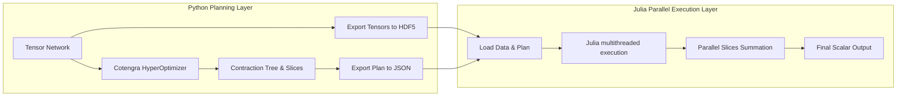

# Architectural Design: Hybrid Python-Julia Parallel Contraction Engine

This document outlines the architecture for a hybrid scientific computing pipeline that combines the strengths of Python's path optimization ecosystem with Julia's high-performance, GIL-free multithreaded execution.



---

## 1. Design Rationale: Why Hybrid?

- **Python (Planning)**: Python hosts **`cotengra`** and **`quimb`**, which are currently the most advanced engines in the world for finding optimal contraction paths and selecting slice indices. Rewriting these complex heuristics in Julia would require years of development.
- **Julia (Execution)**: Julia has **no GIL** and supports native shared-memory multithreading (`Threads.@threads`). It can execute hundreds of slice contractions concurrently in a single process without any object serialization (no Pickling) or Inter-Process Communication (IPC) overhead.

By separating the **planning phase** from the **execution phase**, we achieve the best of both worlds: world-class planning coupled with hardware-limit execution speeds.

---

## 2. Data Exchange Protocol

The planning layer (Python) and execution layer (Julia) communicate via two standardized, high-performance files:

1. **Tensor Data (`tensors.h5` - HDF5 format)**:
   - HDF5 is a language-agnostic, binary format supported by both Python (`h5py`) and Julia (`HDF5.jl`).
   - Tensors are written as contiguous datasets. Julia can read them directly into memory arrays with zero translation overhead.
2. **Contraction Plan (`plan.json`)**:
   - Contains the metadata of the contraction:
     - Number of tensors, their shapes, and original indices.
     - **The Slices**: Which indices are cut and the slice index mappings.
     - **The Contraction Tree**: A list of pairwise contraction steps. Each step specifies:
       - Left tensor ID, Right tensor ID, contract indices, and output tensor ID.

---

## 3. Implementation Details

### A. Python Planning & Export Script (Blueprint)

In Python, we optimize the network, extract the contraction path steps, and export the tensors and JSON plan:

```python
import json
import h5py
import cotengra as ctg
import quimb.tensor as qtn

def export_contraction_job(tensors, edges, target_slices, export_dir="job_data"):
    # 1. Optimize path with cotengra
    tn = qtn.TensorNetwork([qtn.Tensor(t, inds=e) for t, e in zip(tensors, edges)])
    opt = ctg.HyperOptimizer(slicing_opts={'target_slices': target_slices})
    tree = tn.contraction_tree(optimize=opt)
    
    # 2. Export Tensors to HDF5
    with h5py.File(f"{export_dir}/tensors.h5", "w") as f:
        for idx, t in enumerate(tensors):
            f.create_dataset(f"t_{idx}", data=t)
            
    # 3. Export Contraction Steps & Slicing Info to JSON
    # cotengra's tree provides the children pairs and contracted legs for each step
    steps = []
    for parent, left, right, legs in tree.traverse_steps():
        steps.append({
            "parent": int(parent),
            "left": int(left),
            "right": int(right),
            "contract_legs": list(legs)
        })
        
    plan = {
        "nslices": tree.nslices,
        "slice_indices": tree.slice_indices, # indices that were cut
        "steps": steps
    }
    
    with open(f"{export_dir}/plan.json", "w") as f:
        json.dump(plan, f, indent=4)
```

---

## 4. Julia Parallel Execution Engine (Blueprint)

In Julia, we load the HDF5 datasets and JSON steps. We then parallelize the loop over the slices using Julia's native thread-pool:

```julia
using HDF5
using JSON
using LinearAlgebra

# Set BLAS thread count to 1 per Julia thread to avoid CPU thrashing
BLAS.set_num_threads(1)

struct ContractionStep
    parent::Int
    left::Int
    right::Int
    legs::Vector{String}
end

function run_hybrid_engine(job_dir::String)
    # 1. Load plan and tensors
    plan_data = JSON.parsefile(joinpath(job_dir, "plan.json"))
    nslices = plan_data["nslices"]
    
    # Load raw tensors from HDF5
    tensors_file = h5open(joinpath(job_dir, "tensors.h5"), "r")
    num_tensors = length(keys(tensors_file))
    tensors = [read(tensors_file, "t_$i") for i in 0:(num_tensors-1)]
    close(tensors_file)
    
    # Parse contraction steps
    steps = [ContractionStep(s["parent"], s["left"], s["right"], s["contract_legs"]) for s in plan_data["steps"]]
    
    # 2. Parallel Slice Loop (GIL-free, Shared Memory)
    slice_results = Vector{Float64}(undef, nslices)
    
    # Allocate workspace memory buffers per thread to avoid allocations inside the loop
    Threads.@threads for slice_idx in 1:nslices
        # Clone raw tensors into thread-local working buffers
        local_tensors = copy(tensors)
        
        # Apply slice-specific configurations (setting sliced indices to fixed values)
        apply_slice_values!(local_tensors, plan_data["slice_indices"], slice_idx)
        
        # Execute the tree contraction steps sequentially
        for step in steps
            # Perform pairwise tensor contraction
            # (Julia's TensorOperations.jl or OMEinsum.jl is used under the hood)
            local_tensors[step.parent] = contract_tensors(
                local_tensors[step.left], 
                local_tensors[step.right], 
                step.legs
            )
        end
        
        # Store contracted scalar result
        slice_results[slice_idx] = local_tensors[end][1]
    end
    
    # 3. Sum up all slice outputs
    final_result = sum(slice_results)
    println("Contraction completed successfully! Result: ", final_result)
    return final_result
end
```

---

## 5. Architectural Benefits

1. **GIL Elimination**: Julia executes the `Threads.@threads` loop in parallel without lock contention, achieving full core scaling for slice execution.
2. **Zero IPC Copying**: Raw tensors are loaded once into the main process RAM. All Julia threads read directly from this shared RAM buffer, eliminating Python's Pickling and IPC overhead.
3. **No-Copy Array Slicing**: Using `@views` in the `apply_slice_values!` function lets Julia threads index sliced bonds without allocating new memory, minimizing memory bus contention.
4. **BLAS Optimization**: Julia locks standard BLAS threads directly, ensuring that threads do not oversubscribe CPU cores.
